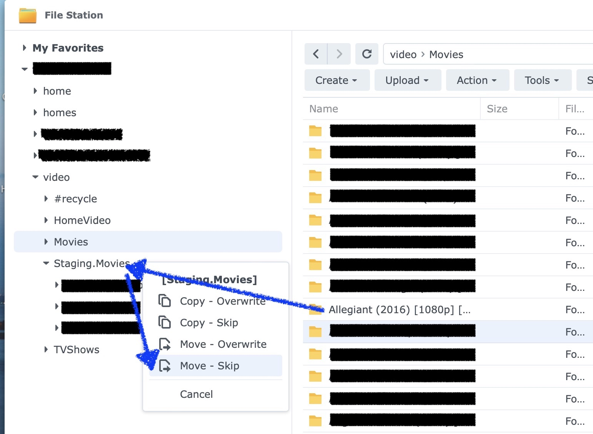
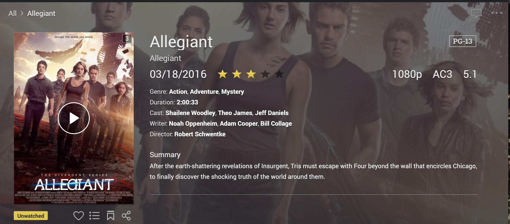

### IMDb to VSMETA
-----------------
by oPromessa, 2024, V0.0.1 
* Published on [https://github.com/oPromessa/imdb2vsmeta/](https://github.com/oPromessa/imdb2vsmeta/)


* If you own a Synology NAS and make use of Video Station.
* And need a quick easy way to populate your Movie Library with Metadata.
* imdb2vsmeta is the answer!

### How to use

* I run it off a Mac with access to the NAS video folder.

* I place the Video folders to be scanned outside the Movies Library (normally video/Movies) in a temp/staging folder video/Staging.Area (Still on the NAS, to make it fast but not scanned as a Library!)
* It looks for Media (.mkv, .mpg, .avi, and .mp4) files named "Movie Title (Year)" format.
* Use the option --search-prefix to operate in batch modes and process only files starting with say A: `--search-prefix A`
* It then looks for the Movie metadata in IMDB
* It then generates the corresponding .vsmeta file to update Video Station
* Side Note: poster and background images are the same.
* You must move back your fodlers/files from video/Stagin.Area into /video.Movies
* Once the process is complete you can move back the Movie folders into the video/Movies Library
* ...and see the magic happens ;)

### Recognition

* https://github.com/TomMeHo/vsMetaFileEncoder
* https://gist.github.com/soywiz/2c10feb1231e70aca19a58aca9d6c16a


### RTFM

* IMPORTANT: The .vsmeta file is available when Video Station indexes the video file first time.
* Use a Staging area to put the Videos and the .vsmeta file **outside** the Video Station Library. You can then move them inside and voila.. VideoStation reads everything nicely!
* Only support Movies .vsmeta encoding
* Will work on TV Shows later on...

### Setup Environment

* Clone a copy of the repository.
* Create a VENV with Python
* Install dependencies

```sh
python3.11 -m venv venv
source venv/bin/activate
pip install imdbmovies
pip install requests
pip install click
```

### Usage
```py
Usage: imdb2vsmeta.py [OPTIONS]

  Searches on a folder for Movie Titles and generates .vsmeta and copy to
  Library.

  IMPORTANT: Use a Staging area on your NAS to generate .vsmeta and only then
  add them to you Video Library.

  It generates the temp files *.jpg and *.vsmeta on the current folder. You
  can then remove them.

Options:
  --search DIRECTORY    Folder to recursively search for media  files to be
                        processed into .vsmeta.
  --search-prefix TEXT  Media Filenames prefix for media  files to be
                        processed into .vsmeta. Eg: --search-prefix A
  --check PATH          Check .vsmeta files. Show info. Exclusive with
                        --search option.
  -f, --force           Force copy if the destination file already exists.
  -n, --no-copy         Do not copy over the .vsmeta files.
  -v, --verbose         Shows info found on IMDB.
  --help                Show this message and exit.
```

* --check option generates the temp files *.jpg and *.vsmeta on the local folder. You can then remove them.

#### Screenshots on How to use

* Moving Files to Staging Area...and back once you run the tool.

 

* Resulting Metadata

